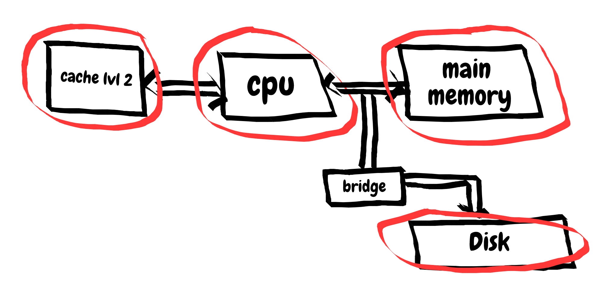
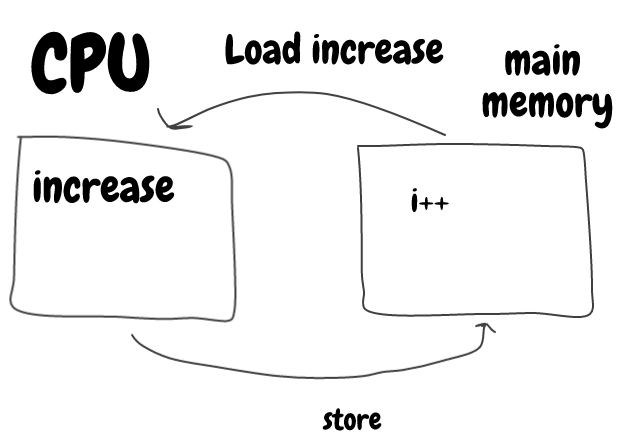
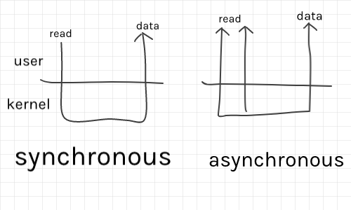

<h1>CSC360</h1>
<h2>Lecture 1 - Review of Computer Organization</h2>

<h5>Overview</h5>
<ol>
	<li>Computer Organization</li>
	<li>What is CPU?</li>
	<li>Memory</li>
	<li>I/O</li>
	<li>Arcitectures</li>
</ol>
<h5>1. Computer Organization</h5>

Focusing on cache lvl 2, cpu, main memory and disk in this class
<h5>2. CPU</h5>

- ALU
- PC
- Lvl 1 Cache
- Registers
- Clock

What happens when i++?

<h5>3. Memory</h5>
- (smallest) Registers (fastest)
- Level-1 cache
- Level-2 cache
- Main Memory
- Disk
- (biggest) USB CD (slowest)

<h5>4. I/O</h5>
<h6>Access</h6>
Address: C port numbers, pin numbers ...
Need to know whether using interrupt, DMA (Direct Memory Access)

<h6>Synhronous vs asynchronous I/O</h6>

<h6>Interrupt vs. Trap</h6>
Trap:  is a software-generated interrupt that is programmer initiated and expected to transfer control to an outlined handler routine

Interrupt: A program control interruption based on an external hardware event external to the CPIT (ex: pressing a key on the keyboard)

